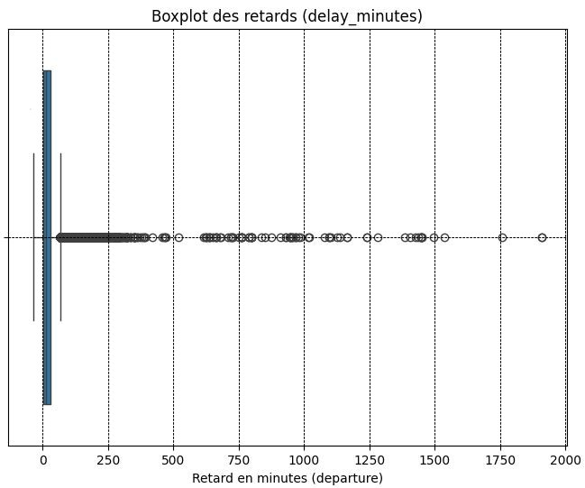
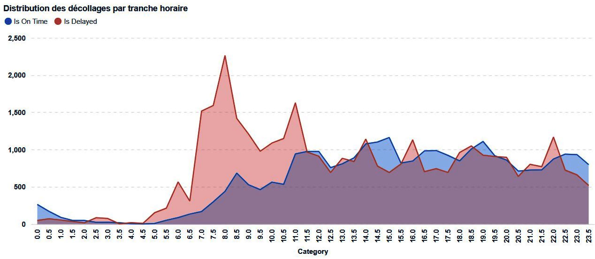
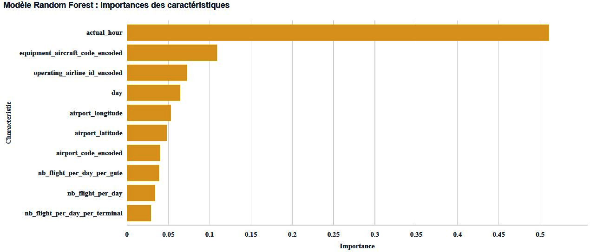

Exploration des données avec Jupyter Lab
========================================

Chargement
----------
 - Postgrest API
 - Postgresql

Exploration
-----------
 - matplotlib
 - numpy

### Statistiques sur les retards des décollages

 - **Nombre de vols** : 64480
 - **Retard moyen** : 22,28 minutes
 - **Ecart type** : 46,13
 - **Retard minimum** : -35 minutes (avance)
 - **Retard médian** : 12 minutes
 - **Retard maximum** : 1908 minutes

Machine Learning
----------------
 - sklearn

Visualisation des résultats
---------------------------
 - metabase

